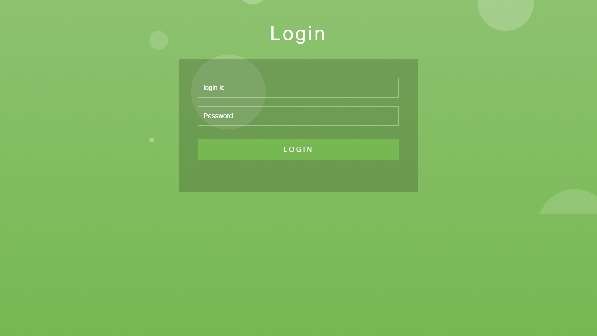
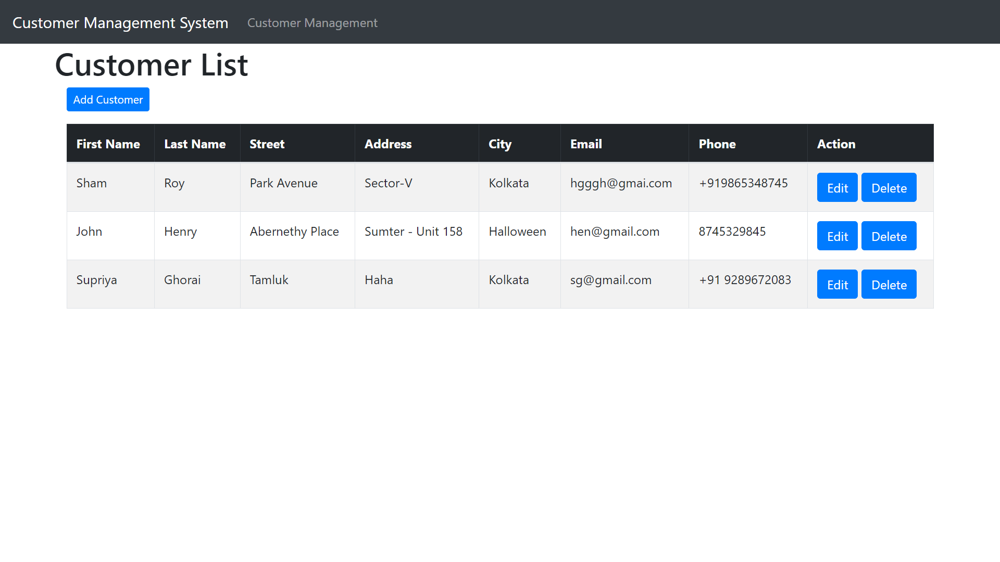
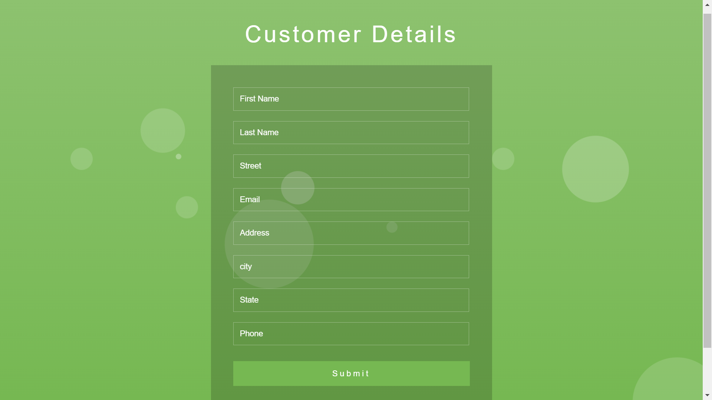

<h1 align="center">Customer Management System🖥️</h1>

Welcome to the API Integration Project for Customer Management. This project is a simple web application that allows users to interact with a set of RESTful APIs for customer management. Users can authenticate, view a list of customers, create new customers, delete customers, and update customer information.


## Table of Contents

* Introduction
* Features
* Usage
* Screen
* API Documentation
* Contribution

## Introduction
This project demonstrates how to integrate and use RESTful APIs to perform basic customer management tasks. It consists of a basic web application with three screens: a login screen, a customer list screen, and a screen to add a new customer.

## Features
The key features of this project include:

* `Authentication`: Users can authenticate using their credentials, and the application will retrieve a bearer token from the authentication API. This token is then used for subsequent API calls.

* `View Customer List`: Users can view a list of customers fetched from the API.

* `Create New Customer`: Users can add new customers by providing necessary details.

* `Delete Customer`: Users can delete existing customers by selecting a customer from the list.

* `Update Customer`: Users can update customer information by selecting a customer from the list and providing updated details.
## Usage
To use this web application for customer management, follow these steps:
1) Clone this repository to your local machine.
```bash
  git clone https://github.com/soumitra2001/Customer_Management_System.git

```
2) Open the project in your preferred Java IDE (e.g., Eclipse, IntelliJ IDEA).

3) Open the project in a web browser by opening the index.html file.

4) You will be presented with the login screen. Use your credentials to log in. Upon successful login, you will be redirected to the customer table.

5) You will then be redirected to the customer list screen, where you can view a list of customers, create new customers, delete existing customers, and update customer information.

6) Enjoy using the Customer Management application!

## Screens
This project consists of three screens:

### Login Screen
* A simple HTML form where users can input their login credentials (email and password).
* Upon successful authentication, the bearer token is obtained and used for API calls.


### Customer List Screen
* Displays a list of customers retrieved from the API.
* Provides options to create new customers, delete existing customers, and update customer information.
* Users can click on a customer to select it for deletion or updating.


### Add a New Customer Screen
* Allows users to input customer details (first name, last name, street, address, city, state, email, phone) and create a new customer.


## API Documentation
Below are the details of the APIs integrated into this project:

#### Authentication API
Path: https://localhost:8080/login
Method: POST

#### Customer Management API
Path: https://localhost:8080/customers
to get the list of customers.

This Page supports the following commands:
* `create`: Create a new customer.
* `delete`: Delete a customer.
* `update`: Update a customer.

## Contribution
Contributions to this project are welcome! If you have suggestions, bug reports, or would like to add new features, please open an issue or submit a pull request. We appreciate your input and collaboration.

## 

Thank you for checking out the API Integration Project for Customer Management! If you have any questions or feedback, please don't hesitate to reach out to me at supriyagro2001@gmail.com. We hope you find this project informative and fun to use.

